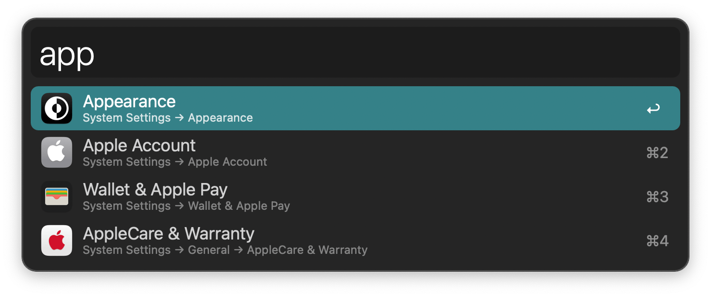

#  System Settings Alfred Workflow

Open macOS System Settings Panes

<a href='https://alfred.app/workflows/alfredapp/system-settings'>⤓ Install on the Alfred Gallery</a>

## Usage

Open System Settings panes via the workflow’s keywords: `about`, `accessibility`, `airdrop and handoff`, `appearance`, `appleid`, `battery`, `bluetooth`, `control centre`, `date and time`, `desktop and dock`, `displays`, `extensions`, `family`, `focus`, `general`, `game centre`, `game controllers`, `internet accounts`, `keyboard`, `language and region`, `lock screen`, `login items`, `mouse`, `network`, `notifications`, `passwords`, `printers and scanners`, `privacy and security`, `profiles`, `screen saver`, `screen time`, `sharing`, `siri and spotlight`, `software update`, `sound`, `startup disk`, `storage`, `time machine`, `touch id and password`, `trackpad`, `transfer or reset`, `users and groups`, `vpn`, `wallet and apple pay`, `wallpaper`, `wi-fi`.

